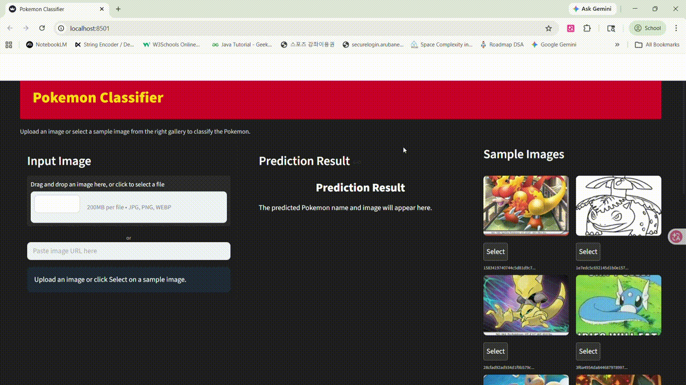
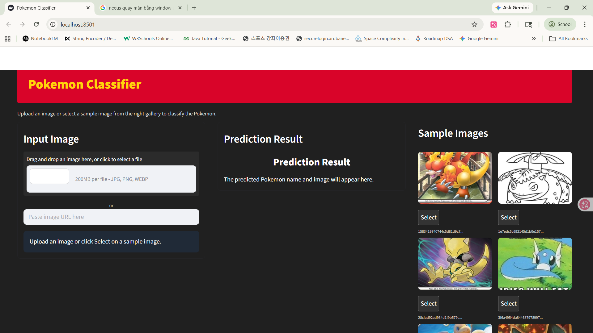

# Pokemon Classification with Transfer Learning

This project implements a Pokemon image classifier using transfer learning.  
The final model is based on ResNet18 with pretrained ImageNet weights and full fine-tuning.  
The project includes model training, experimental comparison, final test evaluation, and an interactive GUI demo.

---

## 1. Project Overview

The goal of this project is to classify Pokemon images into 150 different Pokemon classes.

This project uses transfer learning because training a deep CNN from scratch on a relatively small dataset can lead to poor performance. By starting from a pretrained model, the network can reuse general visual features such as edges, colors, textures, and object shapes, then adapt them to the Pokemon classification task through fine-tuning.

Main features:

- Pokemon image classification with 150 classes
- Transfer learning using ResNet18 and ResNet50
- Five experimental settings for comparison
- Final test evaluation with accuracy, precision, recall, and F1-score
- Streamlit GUI demo with sample image gallery
- Top-5 prediction probabilities

---

## 2. Dataset

The dataset contains labeled Pokemon images organized by class folders.

The dataset was split into three subsets:

```text
data/
├── train/
├── val/
└── test/
```

Each class folder contains images of one Pokemon class.

Example structure:

```text
data/train/Pikachu/
data/train/Charmander/
data/train/Bulbasaur/

data/val/Pikachu/
data/val/Charmander/
data/val/Bulbasaur/

data/test/Pikachu/
data/test/Charmander/
data/test/Bulbasaur/
```

The final classification task includes:

```text
Number of classes: 150
```

---

## 3. Data Preprocessing

All images were resized to 224 × 224 pixels before being passed into the model.

For the training set, data augmentation was applied to improve generalization:

```python
transforms.RandomResizedCrop(224)
transforms.RandomHorizontalFlip()
transforms.RandomRotation(15)
transforms.ColorJitter(brightness=0.2, contrast=0.2)
```

For validation and test sets, only resizing and normalization were applied.

ImageNet normalization was used because the pretrained models were originally trained on ImageNet:

```python
transforms.Normalize(
    [0.485, 0.456, 0.406],
    [0.229, 0.224, 0.225]
)
```

---

## 4. Model Architecture

The project uses pretrained CNN models from `torchvision.models`.

The final classifier layer was replaced with a new classifier for 150 Pokemon classes:

```python
model.fc = nn.Sequential(
    nn.Dropout(0.5),
    nn.Linear(model.fc.in_features, num_classes)
)
```

Dropout was added to reduce overfitting.

---

## 5. Experimental Settings

Five experimental settings were tested.

| No. | Model | Pretrained | Fine-tuning Strategy |
|---:|---|---|---|
| 1 | ResNet18 | False | All layers |
| 2 | ResNet18 | True | FC layer only |
| 3 | ResNet18 | True | Partial fine-tuning |
| 4 | ResNet18 | True | All layers |
| 5 | ResNet50 | True | Partial fine-tuning |

### Fine-tuning Strategies

#### 1. Training from Scratch

The model is initialized without pretrained weights.  
All layers are trained from the beginning.

#### 2. FC Only

All pretrained convolutional layers are frozen.  
Only the final fully connected classifier is trained.

#### 3. Partial Fine-tuning

Most pretrained layers are frozen.  
Only the last block, `layer4`, and the final classifier are trained.

#### 4. Full Fine-tuning

All pretrained layers are trainable.  
The entire network is updated for the Pokemon classification task.

---

## 6. Training Configuration

The following hyperparameters were used:

| Hyperparameter | Value |
|---|---:|
| Image size | 224 |
| Batch size | 32 |
| Learning rate | 0.0001 |
| Optimizer | Adam |
| Loss function | CrossEntropyLoss |
| Epochs | 20 |
| Early stopping patience | 5 |

Early stopping was used to stop training when the validation performance stopped improving.

The best model checkpoint was saved based on validation accuracy and validation loss stability.

---

## 7. Experimental Results

The following results were obtained from the five experimental settings.

| Experiment | Best Accuracy | Best Validation Loss |
|---|---:|---:|
| ResNet18: Pretrained - False, Fine-tuning - All | 0.5059 | 1.9527 |
| ResNet18: Pretrained - True, Fine-tuning - FC Only | 0.4963 | 3.0551 |
| ResNet18: Pretrained - True, Fine-tuning - Partial | 0.9110 | 0.4536 |
| ResNet18: Pretrained - True, Fine-tuning - All | 0.9250 | 0.3904 |
| ResNet50: Pretrained - True, Fine-tuning - Partial | 0.9184 | 0.3034 |

Among the five experimental settings, ResNet18 with pretrained weights and full fine-tuning achieved the highest validation accuracy. Therefore, it was selected as the final model for the GUI demo.

ResNet50 with partial fine-tuning achieved the lowest validation loss, but its validation accuracy was slightly lower than ResNet18 full fine-tuning. Therefore, ResNet18 full fine-tuning was chosen as the final model because validation accuracy was the main selection criterion.

---

## 8. Final Model Retraining

The final selected model was retrained using the following setting:

```text
Model: ResNet18
Pretrained: True
Fine-tuning: All layers
```

Local retraining result:

| Metric | Value |
|---|---:|
| Best Validation Accuracy | 0.9324 |
| Best Validation Loss | 0.3530 |

The final retrained model was saved as:

```text
best_resnet18_preTrue_ftall.pth
```

For GUI and testing, the model file can be copied or renamed as:

```text
best_model.pth
```

---

## 9. Final Test Result

The final demo model was evaluated on the local test set.

| Metric | Score |
|---|---:|
| Test Accuracy | 0.9433 |
| Test Precision Macro | 0.9474 |
| Test Recall Macro | 0.9397 |
| Test F1-score Macro | 0.9354 |

The final model achieved a test accuracy of 94.33%.  
This shows that the fine-tuned ResNet18 model can classify unseen Pokemon images with strong performance.

Since the local dataset split may be different from the original Colab split, the final test result can be slightly different from the validation results reported in the experimental comparison.

---

## 10. GUI Demo

The GUI was implemented with Streamlit.

The demo allows users to:

- Upload their own Pokemon image
- Select a prepared sample image from the right-side gallery
- Display the selected image in the input panel
- Predict the Pokemon class
- Show the confidence score
- Show the top-5 prediction probabilities

Example GUI flow:

```text
1. Select a sample image from the right gallery
2. The image appears in the input panel
3. The model classifies the image
4. The prediction result appears in the result panel
```

Demo GIF:



GUI screenshot:



---

## 11. Project Structure

```text
pokemon_classification/
│
├── README.md
├── app.py
├── train.py
├── train_best_only.py
├── test.py
├── SplitData.py
├── requirements.txt
├── class_names.txt
│
├── sample_images/
│   ├── charmander.jpg
│   ├── bulbasaur.jpg
│   ├── pikachu.jpg
│   └── ...
│
├── demo/
│   ├── pokemon_classifier_demo.gif
│   ├── gui_screenshot.png
│   └── test_result.png
│
└── data/
    ├── train/
    ├── val/
    └── test/
```

---

## 12. How to Run

### 1. Install dependencies

```bash
pip install -r requirements.txt
```

### 2. Run the GUI demo

```bash
streamlit run app.py
```

or:

```bash
python -m streamlit run app.py
```

### 3. Run final test evaluation

```bash
python test.py
```

### 4. Train all experimental settings

```bash
python train.py
```

### 5. Train only the final selected model

```bash
python train_best_only.py
```

---

## 13. Requirements

```text
torch
torchvision
numpy
matplotlib
scikit-learn
pillow
streamlit
```

If OpenCV or Grad-CAM visualization is used, add:

```text
opencv-python
```

---

## 14. Model File

The trained model file is not included in this repository if the file size is too large.

To run the GUI demo or test script, place the trained model file in the project root:

```text
best_model.pth
```

If the model checkpoint is named:

```text
best_resnet18_preTrue_ftall.pth
```

copy or rename it as:

```text
best_model.pth
```

Example command on Windows PowerShell:

```powershell
Copy-Item best_resnet18_preTrue_ftall.pth best_model.pth -Force
```

---

## 15. Discussion

The experiments show that transfer learning is important for this task.

Training ResNet18 from scratch produced much lower validation accuracy compared with pretrained models. The FC-only setting also performed poorly because only the final classifier was trained while the feature extractor remained fixed. Partial fine-tuning improved performance significantly by allowing the last convolutional block to adapt to Pokemon-specific features.

The best validation accuracy was achieved by ResNet18 with pretrained weights and full fine-tuning. This result suggests that updating the entire pretrained network helps the model learn more task-specific visual patterns.

Some classes still have lower precision or recall. This can happen because some Pokemon have visually similar shapes, colors, or poses. In addition, several classes have only a small number of test samples, which can make per-class metrics unstable.

---

## 16. Limitations

This project has several limitations:

- The dataset split can affect the final result.
- Some Pokemon classes have very small numbers of test samples.
- Visually similar Pokemon can still be confused by the model.
- The GUI demo depends on the local `best_model.pth` file.
- The model was evaluated on the prepared test set, not on a large real-world benchmark.

---

## 17. Conclusion

This project successfully implemented a Pokemon classifier using transfer learning.

Among the tested settings, ResNet18 with pretrained ImageNet weights and full fine-tuning achieved the best validation accuracy. The final retrained model achieved 94.33% test accuracy on the local test set.

The Streamlit GUI provides an easy way to test the classifier by uploading an image or selecting a sample image from the gallery. The final result demonstrates that transfer learning is effective for multi-class Pokemon image classification.